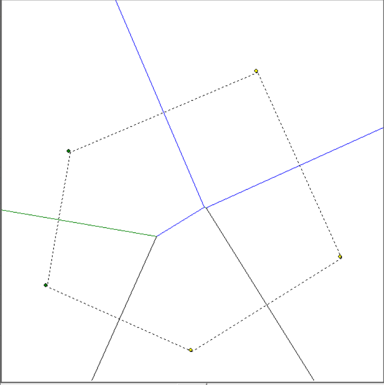

# Voronoi Diagram Generator

This Python project generates Voronoi diagrams based on a set of input points using the tkinter library. The program allows users to visualize the Voronoi tessellation, which is a partitioning of a plane into regions based on the distance to points in a specific subset of the plane.

## Features
- GUI interface for inputting points and displaying the Voronoi diagram.
- Utilizes the divide-and-conquer algorithm for efficient computation.
- Visualization of the convex hull.

## Dependencies
- Python 3
- tkinter (usually included with Python)

## Installation
To use this program, ensure you have Python 3 installed on your system. No additional installation is required as tkinter comes bundled with Python.

## Usage
1. Run the script: `python voronoi_diagram.py`
2. Enter the input points in the GUI that appears.
3. View the generated Voronoi diagram.

## Example
Here's a demo of the Voronoi diagram generated by the program:

## Contributing
Contributions to the project are welcome. Please fork the repository and submit a pull request for any new features or bug fixes.

## License
This project is licensed under the MIT License - see the LICENSE file for details.

## Contact
For any questions or suggestions, please contact Kexin Zhu at zkxshg@gmail.com.

